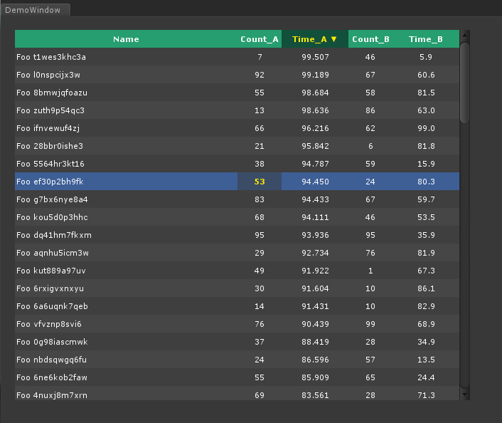

# TableView

## Screenshot



## Features

`TableView` browses data set in a neat table view in Unity Editor.  

- easy-to-use interface for minimal learning time
    + less than 10 lines of code to get it working 
- data browsing and selecting
    + get the selected data and colomn from the `OnSelected` event 
- data sorting by titlebar-clicking 
    + ascending & descending for each column without providing comparing function
- smart scrolling and clipping for large data set
    + only visible data are rendered in the target area
- full detail control if you want to  
    + line height, cell width, cell alignment, value formatting, etc... 

## A Minimal Sample  

A typical table is built in 3 steps:

1. create the table object and setup columns 

``` cs
// create the table with a specified object type
_table = new TableView(this, typeof(FooItem));

// setup the description for content
_table.AddColumn("Name", "Name", 0.5f, TextAnchor.MiddleLeft);
_table.AddColumn("Count_A", "Count_A", 0.1f);
_table.AddColumn("Time_A", "Time_A", 0.15f, TextAnchor.MiddleCenter, "0.000");
```

2. add test data 

``` cs
// add test data
List<object> entries = new List<object>();
for (int i = 0; i < 100; i++)
    entries.Add(FooItem.MakeRandom());
_table.RefreshData(entries);
```

3. add event handler 
``` cs
// register the event-handling function
_table.OnSelected += TableView_Selected;
```

## History

- [2016-11-08] new version: [v1.02 notes](https://github.com/PerfAssist/PA_TableView/releases/tag/v1.0.2) 
    + rely on `PA_Common` now
    + some common functions are merged into `PA_Common`
    + directory name changed (add prefix `PA_`)
- [2016-10-14] initial version
